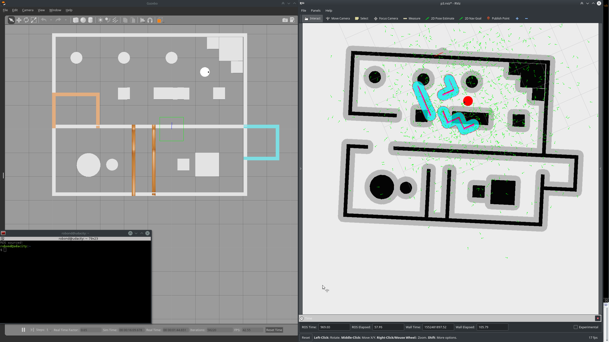

# Where am I?

AMCL parameters tuning practice done for Project 4 of [Udacity Robotics Software Engineer Nanodegree](https://www.udacity.com/course/robotics-software-engineer--nd209).

This is a ROS package containing world and robot descriptions, parameters for amcl and move_base, and relevant launch files. 

Upon running you will get a Gazebo window showing the simulated environment and the robot with its correct pose and an RViz window showing the robot's estimated pose and particles of the AMCL. Set a navigation goal via RViz, and the robot will move while AMCL tries to converge. It will, eventually. Alternatively, you can drive the robot manually with [this teleop package](https://github.com/ros-teleop/teleop_twist_keyboard).

## Requirements

- [ROS Kinetic](http://wiki.ros.org/kinetic/Installation)
- [Gazebo simulator](http://gazebosim.org/) (you would have it if you installed ROS via ros-desktop-full)
- ROS AMCL package
- ROS move_base package

## Usage

Put this package in your workspace. Launch ensemble.launch to run. Alternately, launch world.launch, amcl.launch, and rviz.launch. RViz configuration is included, and the launch files should use that automatically. If they do not, you can manually load p3.rviz (located in the root folder of this package).

## Example results

Pictures from example run are in the figures folder.

Initial

AMCL convergence

Parking in a new room

## Other Worlds

There are other worlds included in the package. They can be found in the world folder. They differ only in what objects are in the rooms. Correspondence between world name and map name (in map folder) is self-explanatory. Maps with _alt suffix are those where doors are manually added. As such, they tend to be wider in the map than in the actual gazebo world. The laser-built local map can handle this.

To use these worlds, edit launch/world.launch and maps/map.yaml accordingly.

Please be careful when doing teleop on rya_geometric, I forgot to increase the mass of some of the objects, and they would wobble when hit.